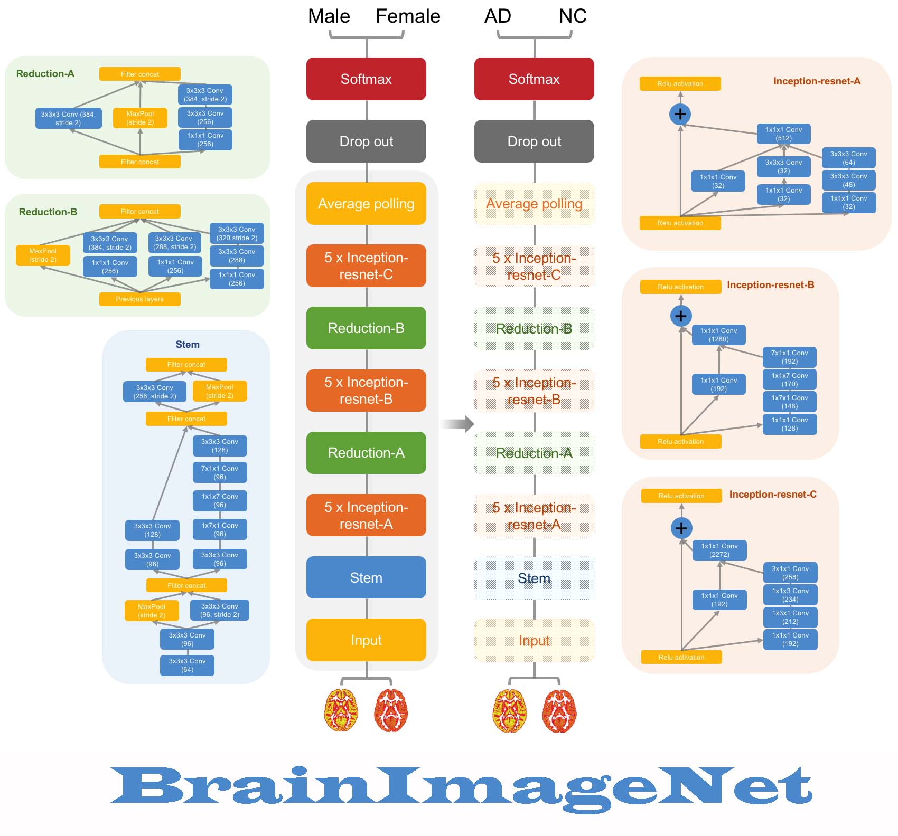

# BrainImageNet

Welcome to BrainImageNet: an Industrial-Grade Brain Imaging Based Deep Learning Classifier. 

We openly shared our [code/framework](https://github.com/Chaogan-Yan/BrainImageNet), trained model (within the below docker hub file, due to the filesize is too large for github), and built an [online predicting website](http://brainimagenet.org:8088/) for whoever are interested in testing our classifier to predict sex and AD status with brain imaging data from anybody and any scanner. 

## 1. Predicting online
Please visit our online predicting website ([http://brainimagenet.org:8088/](http://brainimagenet.org:8088/)).

You can upload **preprocessed gray matter density/volume data** to predict the sex or AD status of the participant(s). Within this zip file, there should be files as wc1XXXXX.nii and mwc1XXXXX.nii (XXXXX is subject ID). Please see an example of [DemoData_BrainImageNet](https://github.com/Chaogan-Yan/BrainImageNet/blob/master/data/DemoData_BrainImageNet.zip).

Alternatively, you can also upload **raw brain structural data** to predict the sex or AD status of the participant(s). Within this zip file, there should be raw NIfTI files as XXXXX.nii (XXXXX is subject ID). 

Of note: as the prediction may take minutes (even tens of minutes depending on the number of participants), you can wait on the website or leave your email in the textbox to receive the prediction results from email attachment (remember to check your spam folder).

## 2. Predicting on local

You can predict the sex or AD status of the participant(s) based on their **preprocessed gray matter density/volume data** on your local machine. What you need to do is simply [installing docker](https://docs.docker.com/get-docker/), and then executing the following two commands.

> docker pull cgyan/brainimagenet
> 
docker run -ti --rm -v **/Data/DPARSFPrecprocessed**:/in -v **/Data/Results**:/out cgyan/brainimagenet

**/Data/DPARSFPrecprocessed**: the input dir, should be:

(1) The working dir of DPARSF (preprocessed by the DPARSF default parameter or DPARSF VBM parameter). There should be a '**T1ImgNewSegment**' folder under this directory. Please see more details for [DPARSF](http://rfmri.org/DPARSF) and [The R-fMRI Course](http://rfmri.org/Course).

(2) Alternatively, can be a directory of preprocessed gray matter density data (wc1) and gray matter volume data (mwc1). Under this directory, there were files as wc1XXXXX.nii and mwc1XXXXX.nii (XXXXX is subject ID). Please see an example of [DemoData_BrainImageNet](https://github.com/Chaogan-Yan/BrainImageNet/blob/master/data/DemoData_BrainImageNet.zip).

**/Data/Results**: the output dir. There would be two files after prediction. 

(1) Sex_Prediction.txt: 1: Male 0: Female. (Prediction close to 1 means male.)

(2) AD_Prediction.txt: 1: AD 0: Healthy. (Prediction close to 1 means AD.) If you are using the results to screen AD risk, then a threshold of 0.3 is recommended (to increase sensitivity at a cost of specificity). OF NOTE: FOR RESEARCH PURPOSE ONLY!
 

